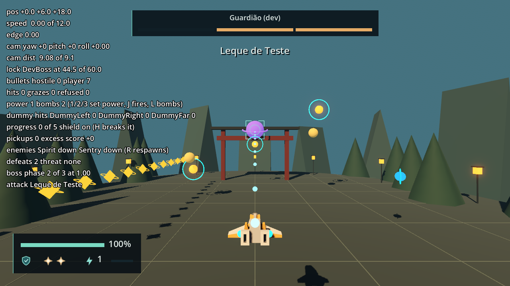
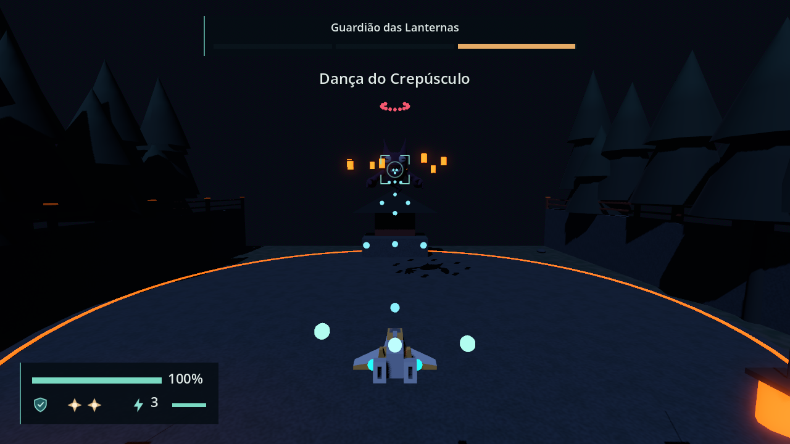

# Bosses validation

Engine: Godot 4.7.2.stable.official.ed1daf0bf, Windows 11, D3D12 Forward+, Jolt physics.
Contract in [engineering/bosses.md](../engineering/bosses.md). The boss scenes' own QA
(D-03, D-04) is in [boss-scenes.log](boss-scenes.log).

# BossController and the dev boss — 2026-09-23 (F12-02)

## Automated

`tools/test.ps1`: 225 passed, 0 failed, no `SCRIPT ERROR`. F12-02 adds no test file (the
sprint's no-new-tests rule of 2026-09-23); the ticket's seven named tests were replaced by
the scripted runs below.

## Scripted runs

Throwaway `SceneTree` scripts, deleted after use, drove `scenes/dev/arena_harness.tscn` with
`spawn_dev_boss` on, headless and then in a 1280 × 720 window. The `DevSpray` was stopped
and the dev Spirit and Sentry defeated first, so every hostile Projectile came from the
boss. No `SCRIPT ERROR` line. The only `ERROR:` lines were the expected `spawn_setup`
refusals and the Lantern Guardian content failure below.

| Check | Result |
| --- | --- |
| Prefab tree | `Enemy` root is `BossController`; `VisualRoot` (sphere and halo), `HitVolume` (`Area3D`, layer 16, mask 0, monitoring and monitorable off, `SphereShape3D` radius 2.5), `Emitters/Main`; no `AnimationPlayer` |
| Dev Definition | `scenes/dev/dev_boss_definition.tres` validates; `metadata/dev = true`, `"Guardião (dev)"`, three Phases of 40 |
| Start | Spawned at `EnemySpawns/DevBoss` (0, 13, −26), in `targetable`. HUD `BossStatus` visible with `BossName` "Guardião (dev)", three bars, `AttackName` "Anel de Teste" |
| Signal order | A second boss with a recorder: `boss_started("Guardião (dev)", 3)`, then `phase_changed(0, "Anel de Teste")` |
| First attack | Entry 1 s + Anticipation 1 s: 15 hostile Projectiles (18-shot ring, 60° gap) at 2.2 s |
| Locked fire, real weapon | Boss locked at 44.6 units, `fire` held: Phase 1 bar 100 → 92.5 in 60 ticks; in the windowed run Phase 2 fell to 0.55 in 130 ticks |
| Phase 1 depleted | Hostile Projectiles 28 → 0 in the same call; one `phase_changed(1, "Leque de Teste")`; HUD Phase 1 at 0 and dimmed, cue "Leque de Teste" |
| Transition | 5 damage one tick into the 0.75 s transition: Phase 2 stayed full; 5 damage 61 ticks later: accepted |
| Phase 3 | `phase_changed(2, "Chuva de Teste")`; its aimed step follows the ship's height |
| Defeat | Two overkills in one tick: one `defeated(&"dev_boss_1", &"arena")`, out of `targetable`, queued for deletion at once (no `defeat_clip`), hostile count 0, HUD boss panel hidden; readout `boss defeated` |
| Clips checked by name | An `AnimationPlayer` holding only `Flying_Idle` and a 0.5 s `Death`, with `step_clip` `Punch` and `phase_clip` `Yes`: one `push_warning` each for `Punch` and `Yes`, then skipped; `Flying_Idle` playing after spawn; on defeat `Death` played and the boss stayed until it ended, freed after 0.5 s |
| Refused setup | `spawn_setup(null, &"", &"", null, null, null, AABB())` returned false with one error per argument; the boss stayed inert and out of `targetable` |
| Astra's Lantern Guardian scene | `scenes/enemies/lantern_guardian.tscn` with `boss_controller.gd` attached at runtime and the exports set as F12-03 will set them (`VisualRoot`, `HitVolume`, `Emitters/Main`, `VisualRoot/Model/AnimationPlayer`, clips `Flying_Idle`, `Punch`, `Yes`, `Death`): no clip warning, `boss_started` and Phase 0, 30 hostile Projectiles after 2.5 s. Driven with the dev Definition, because the real one does not load (next row) |
| `content/bosses/lantern_guardian.tres` (F12-03 part 1, not this ticket) | **Does not load:** `Parse Error` at line 14, where `Phase_Ritual` references `SubResource("Attack_Ritual")` before that sub-resource is declared. Reported to the orchestrator for trunk's F12-03 part 2 |

`bosses-dev-boss.png`: the dev boss locked at 44.5 units, 20 ticks after Phase 1 was
depleted. Hostile count 0 (the clear), the boss panel with Phase 1 empty and dimmed and
Phases 2 and 3 full, the cue "Leque de Teste", and the readout's `boss phase 2 of 3`.

## Tempest Sentinel (F12-06 part 2)

The existing S2-04 marker and reward now select the real Tempest Sentinel prefab and two-Phase definition. The prefab exposes a 2.5-unit hit sphere centered at `(0, 6.9, 0)`, its emitter at `(0, 7.1, -1.7)`, and all four D-04 model clips. The HUD code applies D-07's two-bar offsets. A 300-frame headless main-scene launch exited zero, but sandboxed `user://` logging and certificate access produced environmental `ERROR:` lines; the lane landing gate is the authoritative verification. A controlled fight through both Phases is still owed to the game pass.

## Storm Guardian (F12-07 part 2)

S2-07 now selects the real Dragon_Evolved boss scene with a 5-unit hit sphere centered at `(0, 8.8, 0)`, emitter at `(0, 9.5, -3.5)`, and all four D-04 model clips. Its Definition has three named Phases and the 1,000 score. The existing Director branch completes Stage 2 on the final boss defeat, and Session chooses `Jornada concluída` for a Campaign final stage result. A full player-driven Campaign clear remains to be observed; the sprint landing gate verifies parse, resource validity and boot.

## Not verified here

- The Session and Director wiring (F12-03), score awarding and S1-07.
- A physical keyboard or controller pass (owed by the human pass).

# Lantern Guardian in S1-07 — 2026-09-24 (F12-03)

## Automated

`tools/test.ps1`: 225 passed, 0 failed, no `SCRIPT ERROR`, `Compile Error`, `Failed to load`
or `Parse Error`; the 7 `ERROR:` lines are the suite's intentional ones. 300-frame headless
boot of the project: no `ERROR:` line. F12-03 adds no test file (the sprint's no-new-tests
rule); the ticket's named tests were replaced by the scripted run below.

## Scripted run

A throwaway `SceneTree` driver (`verify_f12_03.gd`, kept in the session scratchpad, not in
the repo) drove `scenes/main.tscn` and the real `GameSession`: Direct Stage 1, S1-01 to
S1-06 cleared through the real Director (ship moved with `reset_to`, enemies defeated with
`EnemyActor.take_damage`), CP1-B activated, then S1-07 entered. The boss was damaged through
`BossController.take_damage`, the callback the `ProjectileSystem` and the Bomb call; Defeat
was forced with `CombatState.take_hit`; Retry was pressed with `ui_accept` on the focused
`RetryButton`, Restart through Pause. Headless, then in a 1280 × 720 window. No
`SCRIPT ERROR` and no clip warning. The only `ERROR:` and `WARNING:` lines were the known
exit-time leaks of the enemy visuals ([stage-director.md](stage-director.md)): the same 17
leaked instances whether one boss or three were spawned and freed, and present in the F10-03
driver's run with no boss.

| Check | Result |
| --- | --- |
| Director setup | `enemy_definitions` keys `sentry`, `spirit` (the Sentry stand-in is gone); `boss_definitions` `lantern_guardian` → `content/bosses/lantern_guardian.tres`; `actor_scenes[&"lantern_guardian"]` → `scenes/enemies/lantern_guardian.tscn`; `check_setup()` 0 messages; `defeat_presentation` and `defeat_animation` empty |
| Spawn | Entering S1-07: one `BossController` (root `Enemy`, scene `lantern_guardian.tscn`) under `RuntimeActors`, no `EnemyActor`; at (0.00, 43.02, −520.00), hover anchor (0, 43, −520) = `Wave1_Boss1`, y 43.02 to 43.44 over 30 ticks (0.6 bob); in `targetable`; clips `Flying_Idle`, `Punch`, `Yes`, `Death` all accepted; live `S1-07/Wave1_Boss1` worth 1000 |
| HUD at spawn | `BossStatus` shown, `BossName` "Guardião das Lanternas", three Phase bars full and lit, `AttackName` "Ritual das Lanternas"; `boss_started` once, Phase 0 once. First hostile Projectile 121 ticks (2.02 s) after `boss_started` (entry 1.0 s + Anticipation 1.0 s), 13 hostile 20 ticks later |
| ExitVolume | Ship teleported to (0, 37.5, −562), inside the ExitVolume (z −564 to −560): 14 ticks later S1-07 still ACTIVE, `stage_cleared` 0, `stage_completed` 0, boss alive |
| Phase 1 depleted | Phase 1 bar 0.67 after 500 damage, 0.33 after 1000; the depleting hit: hostile 39 → 0 in the same call, cue "Fios de Luz", Phase 1 bar 0 and dimmed |
| Transition | 5 damage one tick in: refused (Phase 2 ratio 1.0000); transition 45 ticks (0.75 s) with 0 hostile; 5 damage after it: accepted (0.9967) |
| Phase 2 depleted | Phase 2 fired 121 ticks after the transition (2.0 s charge); its depletion: hostile 15 → 0, cue "Dança do Crepúsculo", Phase 2 bar 0 and dimmed. Phase order "Ritual das Lanternas", "Fios de Luz", "Dança do Crepúsculo" |
| Final defeat | One `boss_defeated(&"lantern_guardian")` in the same call; boss panel and cue already hidden inside it; score 1700 → 2700 (+1000, Graze +0) in the same call; hostile 39 → 0; out of `targetable`; S1-07 completed; one `stage_cleared`, one `stage_completed` (score 2700); one frame later the Session is back on the main menu (no Results until F11-01) with `WorldRoot` empty and the boss freed |
| Retry mid-fight (twice) | Boss in Phase 2, Defeat label "Último checkpoint · Entrada do Santuário", Retry: `RuntimeActors` 0 at once and 3 ticks later, hostile 0, boss panel and cue hidden, ship at (0, 37, −454) = CP1-B `Respawn`, same Director, old boss freed, no `boss_defeated`, S1-07 INACTIVE. Re-entering S1-07: a fresh boss at Phase 1 with every Phase full, `boss_started` +1, panel with three full bars and "Ritual das Lanternas". The Director's six boss and stage signal connection counts and the new controller's five were identical to the first boss's |
| Restart from Pause mid-fight | Pause screen, then Restart: new Director (old freed), old boss freed, no `BossController`, `RuntimeActors` 0, panel and cue hidden, unpaused on the HUD, ship at `PlayerStart` (0, 7, 20), S1-01 active; the new Director's boss signals each have exactly one connection (the Session's) |
| Damage rate, real weapon | Locked on the boss from 38.2 units, `fire` held 600 ticks per level, hostile fire removed every tick so the ship lives: Power Level 2 171 damage in 10 s = 17.1/s (all-hit ceiling 18.0) → Phases of 1500/1500/2100 last 87.7/87.7/122.8 s; Power Level 3 221 in 10 s = 22.1/s (ceiling 23.3) → 67.9/67.9/95.0 s, against the ticket's target of about 25/25/35 s |

The Phase health values are part 1's and Astra's to tune: at the measured 22.1 damage/s,
25/25/35 s at Power Level 3 is about 550/550/775 (Power Level 2 would then take about
32/32/45 s). The 2.0 s attack cue of this run hid before Phase 1's first ring (2.02 s after
it appears) and before Phase 2's first burst (0.75 s transition + 2.0 s charge); only Phase
3's first ring (1.65 s) fired while its cue showed. After this pass `ATTACK_CUE_SECONDS`
became 3.0 s, so every Phase's first shot now comes while its name shows.

## Windowed pass

1280 × 720, D3D12 Forward+. From CP1-B into S1-07 at Power Level 3, locked on the boss from
the fight spot with `fire` held: 46 damage in 150 ticks of real fire, Phases 1 and 2 then
depleted through `take_damage`, and the screenshot taken 1.85 s into Phase 3 with the cue
still shown. The last Phase's defeat gave +1000, one `boss_defeated` and one
`stage_cleared`, and the main menu one frame later.

`bosses-lantern-guardian.png`: the Guardião das Lanternas locked from 38 units at 1.85 s
into Phase 3, with the boss panel's first two bars empty, the cue "Dança do Crepúsculo",
the Phase's first ring above the boss and the Power Level 3 shots.

## Not verified here

- The shrine lighting on defeat: `defeat_presentation` is empty until Astra authors it.
- Retreat containment of the arena, and a physical keyboard or controller pass (owed by the
  human pass).
