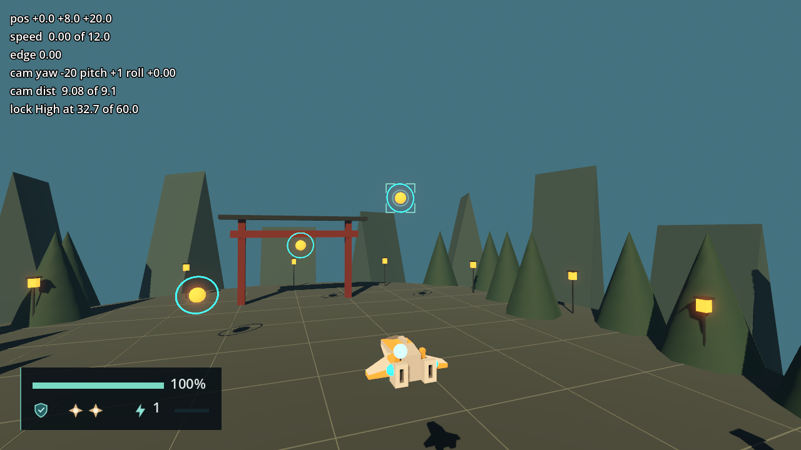

# Combat HUD validation

Engine: Godot 4.7.2.stable.official.ed1daf0bf, Windows 11, D3D12 Forward+. Contract in
[engineering/combat-hud.md](../engineering/combat-hud.md).

# HUD binding and target marker — 2026-09-23 (F4-02)

## Automated

`tools/test.ps1`: 213 passed, 0 failed, no `SCRIPT ERROR`. F4-02 added the 11 tests of
`tests/scene/test_hud_contract.gd` (the HUD scene with a `CombatState`, a `Targeting`
driven through `target_changed`, a camera and a target with a `HitVolume`) and four
cases in `tests/scene/test_game_session_flow.gd` (a Direct Stage 2 Run shows Power Level
2, pause pauses the `CombatState`, Restart rebinds the HUD to the new ship, Return to
Menu unbinds it).

## Scripted pass in the dev arena harness

A throwaway `SceneTree` script (deleted after the run) loaded
`scenes/dev/arena_harness.tscn`, drove `lock_target` and `next_target` as simulated
actions held across two physics ticks, and compared the marker with
`Camera3D.unproject_position` of each target's `HitVolume` after every node had processed
that frame. It ran headless first, then in a 1280 × 720 window, and passed both times.

| Step | Windowed result |
| --- | --- |
| Harness start | Panel bound: `100%`, Shield and both Bombs lit, Power Level `1`; no marker |
| `lock_target` from (0, 8, 20) | Middle locked; marker centered at (640.0, 324.3), projection (640.0, 324.3) |
| `next_target` | High; marker at (640.0, 316.9), projection identical; screenshot below |
| `next_target` | Low; marker at (640.0, 317.2), projection identical |
| `next_target`, then `camera_left` held 60 ticks | Middle again; the lock framing holds the camera about 16 degrees off and the marker stays on it at (766.8, 325.0) |
| Locked target moved 6 units behind the camera | Hidden on the 8 frames the target was behind, shown again once the framing turned to it; 0 frames where the marker and `is_position_behind` disagreed |
| `lock_target` again (release) | Marker hidden |

`combat-hud-marker.png`: the marker on High, the bound panel at the bottom left, the
harness readout at the top left.

**Orbiting cannot put a locked target behind the camera.** The ticket asked to orbit
away until the target is behind; with a lock held, `CameraRig`'s framing pulls the aim
back to the ship-to-target line, and a held orbit settles about 16 degrees off it
(orbit 120 degrees per second against `rotation_damping` 8). A locked target is behind
the camera only when it moves there faster than the framing turns, which is what the
pass above measured.

## Not verified

- A physical keyboard or DualSense pass: every input above is simulated.
- The HUD at other resolutions than 1280 × 720 (GUIDE Section 15).
