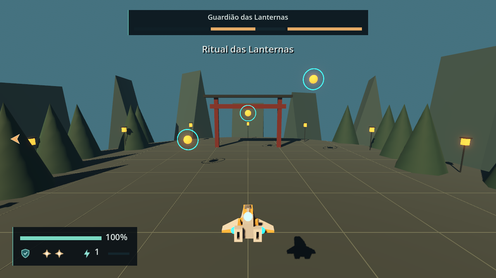
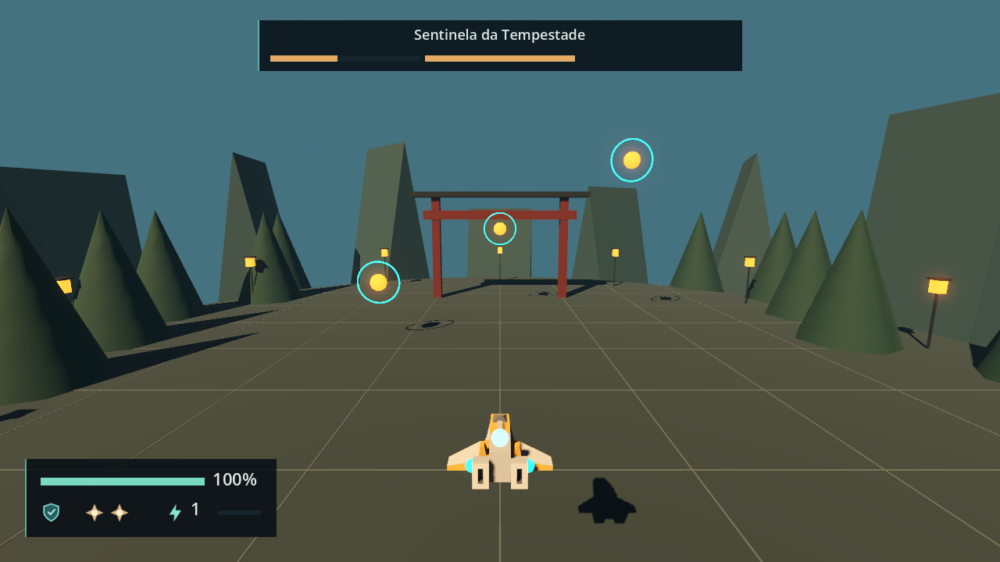

# Combat HUD validation

Engine: Godot 4.7.2.stable.official.ed1daf0bf, Windows 11, D3D12 Forward+. Contract in
[engineering/combat-hud.md](../engineering/combat-hud.md).

# HUD binding and target marker — 2026-09-23 (F4-02)

## Automated

`tools/test.ps1`: 213 passed, 0 failed, no `SCRIPT ERROR`. F4-02 added the 11 tests of
`tests/scene/test_hud_contract.gd` (the HUD scene with a `CombatState`, a `Targeting`
driven through `target_changed`, a camera and a target with a `HitVolume`) and four
cases in `tests/scene/test_game_session_flow.gd` (a Direct Stage 2 Run shows Power Level
2, pause pauses the `CombatState`, Restart rebinds the HUD to the new ship, Return to
Menu unbinds it).

## Scripted pass in the dev arena harness

A throwaway `SceneTree` script (deleted after the run) loaded
`scenes/dev/arena_harness.tscn`, drove `lock_target` and `next_target` as simulated
actions held across two physics ticks, and compared the marker with
`Camera3D.unproject_position` of each target's `HitVolume` after every node had processed
that frame. It ran headless first, then in a 1280 × 720 window, and passed both times.

| Step | Windowed result |
| --- | --- |
| Harness start | Panel bound: `100%`, Shield and both Bombs lit, Power Level `1`; no marker |
| `lock_target` from (0, 8, 20) | Middle locked; marker centered at (640.0, 324.3), projection (640.0, 324.3) |
| `next_target` | High; marker at (640.0, 316.9), projection identical; screenshot below |
| `next_target` | Low; marker at (640.0, 317.2), projection identical |
| `next_target`, then `camera_left` held 60 ticks | Middle again; the lock framing holds the camera about 16 degrees off and the marker stays on it at (766.8, 325.0) |
| Locked target moved 6 units behind the camera | Hidden on the 8 frames the target was behind, shown again once the framing turned to it; 0 frames where the marker and `is_position_behind` disagreed |
| `lock_target` again (release) | Marker hidden |


`combat-hud-marker.png`: the marker on High, the bound panel at the bottom left, the
harness readout at the top left.

**Orbiting cannot put a locked target behind the camera.** The ticket asked to orbit
away until the target is behind; with a lock held, `CameraRig`'s framing pulls the aim
back to the ship-to-target line, and a held orbit settles about 16 degrees off it
(orbit 120 degrees per second against `rotation_damping` 8). A locked target is behind
the camera only when it moves there faster than the framing turns, which is what the
pass above measured.

## Not verified

- A physical keyboard or DualSense pass: every input above is simulated.
- The HUD at other resolutions than 1280 × 720 (GUIDE Section 15).

# Boss panel, attack cue and threats — 2026-09-23 (F4-03)

## Automated

`tools/test.ps1`: 225 passed, 0 failed, no `SCRIPT ERROR` (the existing suite, including
`test_hud_contract.gd`). F4-03 adds no test file: the sprint's no-new-tests rule of
2026-09-23 replaced the ticket's listed tests with the self-checking harness run below.

## Scripted pass: `scenes/dev/hud_harness.tscn`

```powershell
tools/godot.ps1 --headless --path . res://scenes/dev/hud_harness.tscn
tools/godot.ps1 --path . res://scenes/dev/hud_harness.tscn
```

`HUD_HARNESS_OK`: 26 checks headless, and the same 26 plus the two screenshots in a 1280 × 720 window. The three
`ERROR` lines in its output are the deliberate refusals (side 0, a third bar on a
two-Phase boss, four Phases).

| Step | Result |
| --- | --- |
| `show_boss("Guardião das Lanternas", 3)` | Panel and name shown; three bars at 100, lit |
| Phase 1 drained over 1 s, then 0; Phase 2 set to 0.6 | Phase 1 at 0 with `completed_phase_modulate`; Phase 2 at 60, lit; Phase 3 at 100. A ratio of 1.7 fills the bar |
| `show_attack_cue("Ritual das Lanternas", 1.5)`, `show_threat(-1, 1.0)` | Cue and left threat shown; screenshot `combat-hud-boss-3.png` |
| Cue of 1 s | Shown at 0.85 s, hidden at 1.15 s |
| A second cue 0.6 s into the first | Text replaced; still shown 0.6 s later; hidden 0.55 s after that |
| Left 0.5 s and right 1.0 s threats | Left hidden at 0.65 s while right still shows; right hidden at 1.15 s |
| Right 1.0 s, then a 0.2 s repeat at 0.5 s | Still shown 0.35 s after the repeat: a shorter repeat does not shorten it |
| Then a 1.0 s repeat | Still shown 0.65 s later; hidden at 1.15 s: the timer was extended |
| `show_threat(0, 1.0)` | Reported, nothing shown |
| Cue and left threat of 0.5 s, then 1 s of `tree.paused` | Both kept through the pause; both hidden 0.65 s after unpausing |
| `show_boss("Sentinela da Tempestade", 2)`, Phase 1 at 0.45 | Name, two bars (45 and 100) lit, `Phase3` hidden; `set_phase_health(2, …)` reported and ignored; screenshot `combat-hud-boss-2.png` |
| `show_boss(…, 4)` | Reported and clamped to three bars |
| `hide_boss()` with a cue up | Panel and cue hidden; bars back to 100 and lit |
| `unbind()` with the panel, a cue and both threats up | Nothing left on screen |



`combat-hud-boss-3.png`: Phase 1 spent and dimmed (it reads as an empty track at alpha
0.3), Phase 2 at 60 %, Phase 3 full; the attack cue under the panel; the left threat.



`combat-hud-boss-2.png`: the two-Phase layout. `Phase3` is hidden and the right third of
the panel stays empty (GUIDE Section 15 positions; a re-layout is Astra's call).
