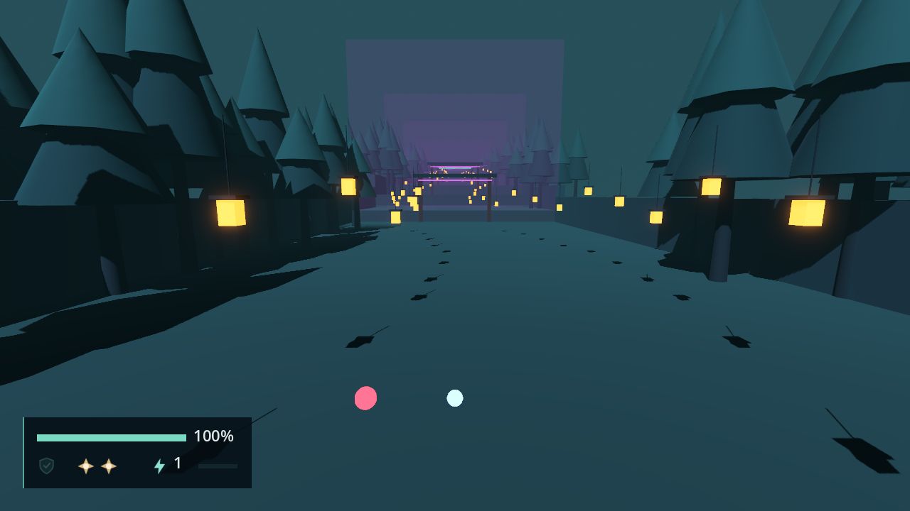
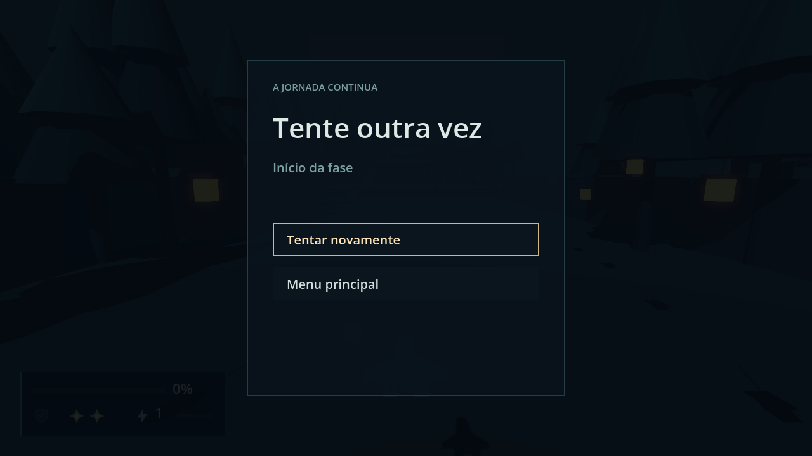
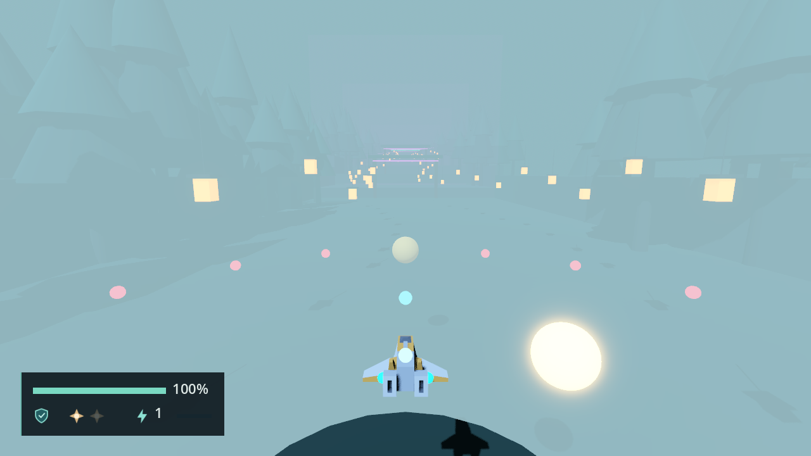
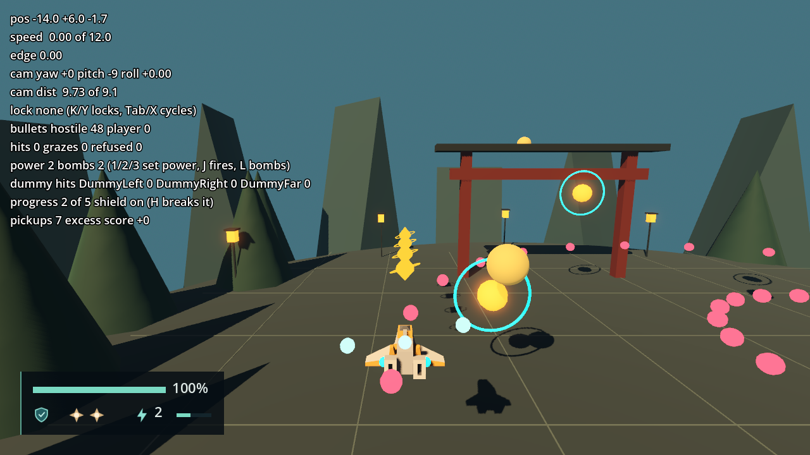

# Combat validation

Engine: Godot 4.7.2.stable.official.ed1daf0bf, Windows 11, D3D12 Forward+. Contract in
[engineering/damage-pickups.md](../engineering/damage-pickups.md). Each F7 ticket adds its
own headed section.

# Hits, Graze and Defeat — 2026-09-23 (F7-01)

## Automated

`tools/test.ps1`: 225 passed, 0 failed, no `SCRIPT ERROR`. F7-01 adds no test file (the
sprint's no-new-tests rule of 2026-09-23).

## Scripted pass: `tools/validate_combat.gd`

```powershell
tools/godot.ps1 --headless --path . --script res://tools/validate_combat.gd
tools/godot.ps1 --path . --script res://tools/validate_combat.gd
```

`COMBAT_OK` headless and in a 1280 × 720 window, with no `SCRIPT ERROR` or `ERROR:` line.
It starts Direct Stage 1 through the real Session and fires hostile Projectiles at the
ship's Core through the real `ProjectileSystem`. The checks run in the order the
Invulnerability windows allow (1, 2, 7, 3, 8, 4, 6, 5, then 9 to 13).

| # | Check | Measured |
| --- | --- | --- |
| 1 | First Core hit | Shield off, Health 100, Invulnerable, 1 hit reported |
| 2 | Hit during Invulnerability | Health 100, Shield still off; the field passed it through (0 reported) |
| 3 | Hit after the window | Health 90; the Shield hit's window lasted 60 ticks (1.000 s) |
| 4 | Two Projectiles on the Core in one tick | Health 80, 1 hit reported |
| 5 | A Graze 0.60 from the Core | Graze +1, score +10, Health unchanged |
| 6 | A Graze while Invulnerable | Graze +0, score +0 |
| 7 | Blink while Invulnerable | `VisualRoot` shown on 38 and hidden on 36 frames headless (15 and 14 windowed); `CoreVisual` never hidden; the ship shown after the window |
| 8 | Pause | Still Invulnerable after 90 paused ticks; after resuming the window ended 60 running ticks later |
| 9 | Defeat | After 8 hits: tree paused, Defeat on top once, `Layout/RetryLocation` reads `Início da fase`, `clear_time()` held at 3.567 s over 60 ticks, `defeated` once, a later hit `REJECTED`, `pause` ignored |
| 10 | `retry` | A new ship at `PlayerStart`, Health 100, Shield on, 2 Bombs, `clear_time()` 0.000, HUD on top, tree running |
| 11 | `return_to_menu` from Defeat | Main menu, `WorldRoot` empty, tree running |
| 12 | Power Pickups | Ten reach Power Level 3 with score +0; the eleventh adds +50 once |
| 13 | Two `restart_stage` requests, then one Graze | Graze +1, score +10: no doubled connection |

Check 9 counts the Defeat entries through `Interface`'s private router (no public
accessor exists); it is a dev tool, not a contract.



`combat-hit-flicker.png`: mid-blink, `VisualRoot` hidden and the white Core still lit;
the HUD shows 100 % with the Shield dimmed, and the rejected Projectile of check 2
passing through.



`combat-defeat.png`: the Defeat overlay ("Tente outra vez", `Início da fase`) over the
frozen stage, the HUD at 0 %.

After the reviewer's pass, `PlayerController` also shows `VisualRoot` when the tree
pauses, so a ship paused mid-blink is not hidden under Pause or Defeat; a headless rerun
after that change was `COMBAT_OK` again. The screenshots come from the run before it.

## Not verified

- A physical keyboard or pad; every input is synthetic.
- That the controls are off on Defeat: covered by `_set_paused(true)` (tree paused and
  `set_controls_enabled(false)`), not measured by the tool.

# Bomb — 2026-09-23 (F7-02)

## Automated

`tools/test.ps1`: 225 passed, 0 failed, no `SCRIPT ERROR`; no test added or changed (the
sprint's no-new-tests rule).

## Scripted pass: `tools/validate_combat.gd`, checks 14 to 21

`COMBAT_OK` for all 21 checks, headless and then in a 1280 × 720 window, with no
`SCRIPT ERROR` or `ERROR:` line. The Bomb checks run on a fresh stage entry with two
Bombs, and every press is a `bomb` event that only the `PlayerWeapon` reads.

| # | Check | Measured |
| --- | --- | --- |
| 14 | A `bomb` press under Pause, then gamepad B on Pause (which resumes) | 2 of 2 Bombs after each; B resumed the game |
| 15 | One press held 30 ticks | 1 Bomb left, `bombs_used` +1 |
| 16 | 35 hostile Projectiles: 18 inside the 10-unit radius (a single, the Graze-Volume one and a ring of 16) and 17 outside it (a single and a ring of 16); one player shot inside | Hostile 35 → 17, all 17 outside kept; the player shot kept |
| 16b | The hostile one 0.6 from the Core, spawned in the Bomb's own tick, with the Bomb's Invulnerability lifted for that tick so the clear alone decides | Graze +0, none reported |
| 17 | A `TargetDummy` 4 from the Core and one 12 away | The inside one took 20 damage in 1 hit; the outside one 0 |
| 18 | The blast | Appeared under `WorldRoot` and freed itself within 0.4 s |
| 19 | Invulnerability after the Bomb | A Core hit at 1.5 s passed through (0 reported); one at 2.1 s landed (1 reported) |
| 20 | Second and third presses | The second spent the last Bomb; the third did nothing; `bombs_used` +2 in all |
| 21 | Defeated with two Bombs, then a press | Still 2 Bombs |

The reviewer found that check 16b could not fail as first written: the Bomb's own
Invulnerability, mirrored to the field before its sweep, blocked the Graze without the
clear. The tool now lifts it for the Bomb's tick only. With the clear removed from
`_on_bomb_activated`, checks 16 and 16b both fail (hostile 35 → 35, Graze +1); with it,
both pass. That rerun, and the one after the handler was reordered to damage last, were
headless; the screenshot comes from the windowed run before those fixes.



`combat-bomb.png`: one tick after the Bomb. The translucent blast fills the 10-unit
radius, and the dummy inside flashes. The outer hostile ring and the player shot remain.
The HUD shows one Bomb left.

# Pickups — 2026-09-23 (F7-03)

## Automated

`tools/test.ps1`: 225 passed, 0 failed; no test added (the sprint's no-new-tests rule).

## Harness pass: `scenes/dev/arena_harness.tscn`

A throwaway `SceneTree` script (not in the repo) loaded the real arena harness, flew its
ship by position and checked what reached the harness's `CombatState`. `PICKUPS_OK` for
every check, headless and then in a 1280 × 720 window. The only `ERROR:` line is the one
the bad-setup case expects. Expected values come from PLANEJAMENTO Section 4: five Power
Pickups per level, Power Level 3 at most, 50 per excess Pickup, and a Shield Pickup that
stays while the Shield is up.

| Case (the ticket's list) | Measured |
| --- | --- |
| Dev prefabs follow the contract | Both roots are `Pickup`, layer 0, mask 2, monitoring on, monitorable off, the right `kind`, a 0.9 sphere and a `Node3D` `Visual` |
| Without `setup`, and after `setup(&"", ...)` | Both stayed, did not move and credited nothing with the ship on them; the bad one reported one `ERROR:` naming its node path |
| Another layer-2 body | A second `CharacterBody3D` on layer 2 sat on a Pickup for 8 ticks: not accepted |
| Duplicate callbacks | The ship on a Pickup plus two extra `body_entered` emissions that tick, then 5 overlapping ticks: progress 1, `accepted` once, freed |
| Paused | No drift with the ship 4 away and no acceptance with the ship on it, over 8 ticks each; left alone after resuming away from it |
| Defeated | No acceptance over 8 ticks on it; after `start(1)` it was taken once |
| Attraction range | Unmoved over 10 ticks at distance 10; at distance 4 the gap fell to 3.30 in 3 ticks and it was taken |
| The row, flown at 8 units per second | `power_changed` gave (1,1) (1,2) (1,3) (1,4) (2,0) (2,1) (2,2) (2,3) (2,4) (3,0); the eleventh gave `score_awarded(50)` once and `accepted` carried 50; each of the eleven ids accepted once; only the Shield Pickup left |
| Shield Pickup while shielded | Unmoved over 10 ticks with the ship 4 away, and still there after 10 ticks with the ship on it |
| After the Shield breaks | One `take_hit()` with the ship on it: taken within 3 ticks with no new `body_entered`, the Shield back on, the Pickup freed |

The readout after the row read `power 3`, `progress 0 of 5 shield on`, `pickups 11 excess
score +50`.



`pickups-arena.png`: mid-row, seven Pickups taken. The readout shows Power 2 with progress
2 of 5, and the HUD's Power 2 bar matches. The next gold crystals drift toward the ship
while the ones farther ahead wait.

## Not verified

- A physical keyboard or pad: the ship was moved by position, not flown by input.
- Stage use: nothing spawns Pickups in a stage until F10-01.
