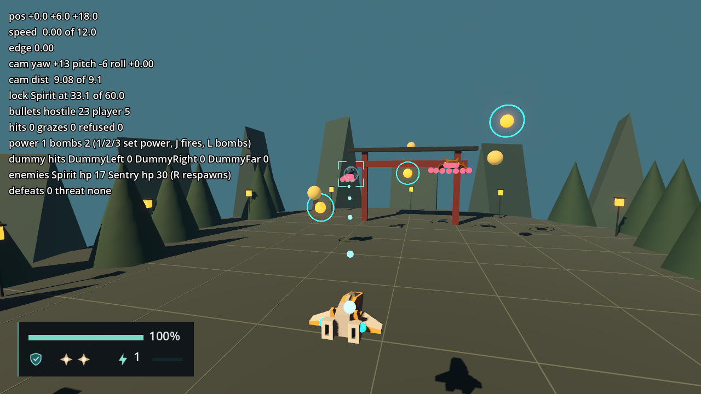

# Enemies validation

Engine: Godot 4.7.2.stable.official.ed1daf0bf, Windows 11, D3D12 Forward+, Jolt physics.
Contract in [engineering/enemies.md](../engineering/enemies.md).

# EnemyActor and the dev Spirit and Sentry — 2026-09-23 (F9-02)

## Automated

`tools/test.ps1`: 225 passed, 0 failed, no `SCRIPT ERROR`. F9-02 adds no test file (the
sprint's no-new-tests rule of 2026-09-23); the ticket's nine named tests were replaced by
the scripted runs below.

## Scripted runs

Throwaway `SceneTree` scripts, deleted after use, drove `scenes/dev/arena_harness.tscn`
headless and then in a 1280 × 720 window, with the harness's `DevSpray` stopped so every
hostile Projectile came from the enemies. No `SCRIPT ERROR` line; the only `ERROR:` lines
were the seven expected `spawn_setup` refusals of the last check.

| Check | Result |
| --- | --- |
| Prefab trees | Both roots are `EnemyActor` named `Enemy`, with `VisualRoot`, `HitVolume` (`Area3D`, layer 16, mask 0, monitoring and monitorable off, a `SphereShape3D` of radius 1.0 or 0.9), `Emitters/Main` and the visual's `Model/AnimationPlayer` |
| Dev content | `spirit.tres` and `sentry.tres` validate with no message; each and its pattern carry `metadata/dev = true` |
| Spawn | The harness spawned `Spirit` at (−6, 9, −12) and `Sentry` at (6, 10, −16) under `CombatArena/RuntimeActors`, both in `targetable`, health 20 and 30 |
| Hit sphere registered | Queried at physics priority 50 (after the actors, before the `ProjectileSystem`): `targets_in_radius` at the Spirit's `HitVolume` returns its instance id |
| Anticipation | `VisualRoot` scale 1.17 twenty ticks in; 0 hostile Projectiles after 56 ticks (0.93 s), 10 after 66 ticks, 23 after 2.1 s |
| Player shots | Five PLAYER Projectiles aimed at the Spirit's `HitVolume`: health 20 → 15 |
| Locked fire, real weapon | Spirit locked, `fire` held: defeated after 141 ticks (2.35 s), 20 hits, from about 30 units away |
| Off-screen warning | No report while both were on screen. With the camera turned 180°: Spirit (world −X, on the turned camera's right) reported +1, Sentry reported −1; the readout showed the last one and `Hud.show_threat` was called |
| Defeat | `take_damage(1000)` twice in one tick: one `defeated(&"Spirit_1", &"arena")`, out of `targetable`, `is_queued_for_deletion()`, freed two ticks later |
| Bomb path | `damage_targets_in_radius(sentry, 5, 30)` at priority 50 damaged 1 target and defeated the Sentry |
| Respawn | Key R spawned a new Spirit and Sentry; the readout read `hp 20` and `hp 30` again, `defeats` kept counting |
| Refused setup | `spawn_setup(null, &"", &"", null, null, null, AABB())` printed one error per argument, and the actor stayed out of `targetable` with physics off and registered nothing |
| Hit sphere placement | A translucent sphere drawn at each `HitVolume` covered the Spirit's torso and the Sentry's head and body: Astra's visual scenes are centered on `VisualRoot`, so the spheres sit at the root origin |

`enemies-arena.png`: the Spirit locked (marker on it) at 33 units, player shots streaming
to it and its health at 17, its aimed burst leaving toward the ship; the Sentry's seven-shot
fan on the right, by the torii gate.

## Finding for another lane (resolved by F6-04)

**Locked shots missed close enemies.** With the Spirit 10 to 16 units away, the first shots hit
(5 to 7), then none for 200 ticks: once the camera's lock framing blends in (pitch about −17°,
the target about 75 px above the screen center), the shots passed about 3.5 units from the
Spirit's center, outside its 1.0 radius. The angle from the Muzzle was just beyond the 10°
main Aim Assist cone. At about 30 units the same lock killed the Spirit in 2.35 s. This was
`PlayerWeapon`'s forward and cone against `CameraRig`'s lock framing (F6-03, F1-03), not the
enemy adapter. F6-04 fixed it on 2026-09-23; see the next section.

# Aim Assist under a lock — 2026-09-23 (F6-04)

**Resolved.** Under a Target Lock, `PlayerWeapon` now measures the Aim Assist from the camera:
the angle between the view and the lock, against the shot's cone widened by
`lock_assist_degrees − main_assist_degrees` (25° for the main shot). Contract in
[engineering/weapon-rendering.md](../engineering/weapon-rendering.md) "Aim Assist under a
lock". `tools/test.ps1`: 225 passed, 0 failed, no `SCRIPT ERROR`; no test added (sprint rule).

**Method.** A throwaway `SceneTree` script, deleted after use, ran the arena harness in a
1280 × 720 window. For each distance it did the following:

- spawn a fresh harness with the `DevSpray` stopped and the Spirit's marker straight ahead of
  the ship, 2 units above it;
- defeat the Sentry;
- lock the Spirit;
- wait 60 ticks for the lock framing to blend in fully;
- hold `fire` until the Spirit fell, for at most 10 s.

Hits are the field's `enemy_hit` events on the Spirit (20 health; Power Level 1 fires 10 main
shots per second).

| Distance (actual at the start) | Before F6-04, locked | After F6-04, locked | After, locked, Power Level 3 | After, no lock |
| --- | --- | --- | --- | --- |
| 10 (12.1) | alive after 10 s, 0 hits | defeated in 2.02 s, 9.9 hits/s | 0.93 s, 21.4 hits/s | alive after 10 s, 0 hits |
| 16 (18.0) | alive after 10 s, 0 hits | defeated in 2.12 s, 9.4 hits/s | 1.03 s, 19.4 hits/s | alive after 10 s, 0 hits |
| 30 (31.9) | defeated in 2.35 s, 8.5 hits/s | defeated in 2.35 s, 8.5 hits/s | 1.27 s, 15.8 hits/s | alive after 10 s, 0 hits |
| 50 (51.9) | defeated in 2.68 s, 7.5 hits/s | defeated in 2.68 s, 7.5 hits/s | 1.58 s, 12.6 hits/s | alive after 10 s, 0 hits |

- **Locked fire now hits at every distance.** The kill time at 10 to 16 units (2.0 to 2.1 s)
  is better than at 30 (2.35 s), which is unchanged, as is 50.
- **Familiars follow the lock too.** At Power Level 3, 23 shots per second land about 92 % at
  10 units.
- **Unlocked fire is unchanged.** There is no assist without a lock, before or after F6-04.
  The shots fly to the screen center 72 units out, so they miss a Spirit 2 units above the
  ship's line. The unlocked code path computes exactly what it did before.

## Not verified here

- A physical keyboard or controller pass (owed by the human pass, as for F1 to F7).
- The Director's spawns, score and Wave completion (F10-01).
