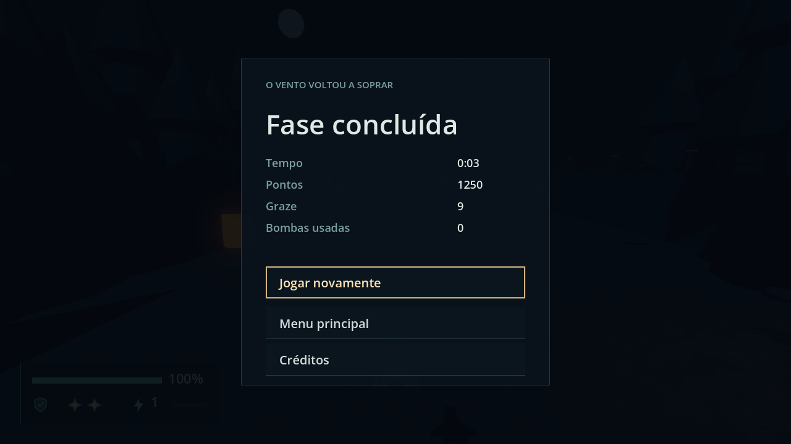
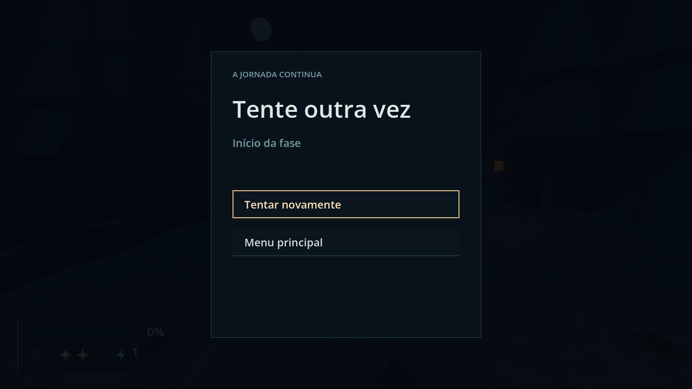

# Run flow validation

Engine: Godot 4.7.2.stable.official.ed1daf0bf, Windows 11, D3D12 Forward+. Contract in
[engineering/run-flow.md](../engineering/run-flow.md).

# Results, Defeat and Pause — 2026-09-24 (F11-01)

## Automated

`tools/test.ps1`: 225 passed, 0 failed, no `SCRIPT ERROR`. One existing test changed with
the behavior: `test_a_completed_stage_returns_to_the_menu_until_results_exist` is now
`test_a_completed_stage_shows_results`. No test is added (the sprint's no-new-tests rule).

## Driven pass: `scenes/main.tscn`

A throwaway `SceneTree` script (not in the repo) drove the real Session. Buttons were
pressed through their `pressed` signal, and Back and `pause` through `push_input`. A clear
came from `StageDirector.stage_cleared.emit()`, which reaches `complete_stage()` deferred,
as a real one does. Values came from real ticks plus `RunState.add_score`, `add_graze` and
`note_bomb_used`, and Defeat from `CombatState.take_hit`. The pass ran headless, then
windowed for the two screenshots. There was no `SCRIPT ERROR`. The only `WARNING:` lines
were the expected "not implemented yet" for Continuar and Jogar novamente.

| Check | Measured |
| --- | --- |
| Pause shows the Attempt's score and Graze | `Pontos  123     Graze  4` after `add_score(123)` and `add_graze(4)` |
| Pause → Opções → Back → Continuar | Options with the tree paused, Back to Pause, Continuar to the HUD unpaused |
| Defeat before any Checkpoint | `Início da fase`; Back does nothing; Tentar novamente puts the HUD back, unpaused, Health 100 |
| Defeat after CP1-A | `Último checkpoint · Portal Selado` (the Checkpoint's `display_name`); Menu principal gives the main menu, unpaused, `WorldRoot` empty |
| Direct Stage 1 clear → Results | Results, tree paused, one `stage_completed`. Values `0:02`, `4321`, `7`, `1` for `clear_time` 2.083, score 4321, Graze 7, one Bomb used |
| Direct Stage layout | Continue hidden, Replay shown and focused, heading `Fase concluída` |
| Victory once | `run_ended` `[true]`, phase `RUN_ENDED`; still `[true]` after Menu principal |
| Frozen under Results | `clear_time` 2.100 → 2.100 and the ship unmoved over 90 ticks; the stage still loaded |
| Back and `pause` on Results | Both do nothing; still Results, still paused |
| Results → Créditos → Back | Credits with the tree paused, then Results with the same four values |
| Results → Menu principal | Main menu, unpaused, `WorldRoot` empty |
| Campaign Stage 1 clear | Continue shown and focused, Replay hidden; phase `STAGE_COMPLETE`, no `run_ended`; Menu principal emits `run_ended(false)` once |
| Final-victory layout | `_results_params` gives `final_victory`, `direct_stage` and `campaign_stage_1` for the three cases. Pushed: heading `Jornada concluída`, both buttons hidden, focus on Menu principal, `5:01` for 301.9 s |
| Missing params | `—` in all four values |
| Defeat and a clear in the same step | Results replaces Defeat (visible `hud`, `results`); Menu principal leaves |
| `STAGE_RESULT` line | Printed once per clear, for example `STAGE_RESULT stage=stage_01 mode=DIRECT_STAGE clear_time=2.10 score=4321 graze=7 bombs=1 attempt=1` |

**Rounding fix.** The first windowed run showed `0:02` for a 3.00 s clear, because 180 ticks
of 1/60 s add up to 2.99999. The time is now snapped to the millisecond before it is
floored. The rerun shows `0:03`, and the headless pass was rerun on that code and passed.

## Windowed pass

The window was 1280 × 720. Direct Stage 1 was flown forward with `fire` held for 150 ticks,
then cleared: Results over the frozen stage. Then Menu principal, Direct Stage 1 again, and
a Defeat.

`run-flow-results.png`: "Fase concluída" with `0:03`, `1250`, `9`, `0`. Jogar novamente is
focused, with Menu principal and Créditos below it. The HUD sits dimmed under the panel.

`run-flow-defeat.png`: "Tente outra vez" with `Início da fase` and Tentar novamente focused.
