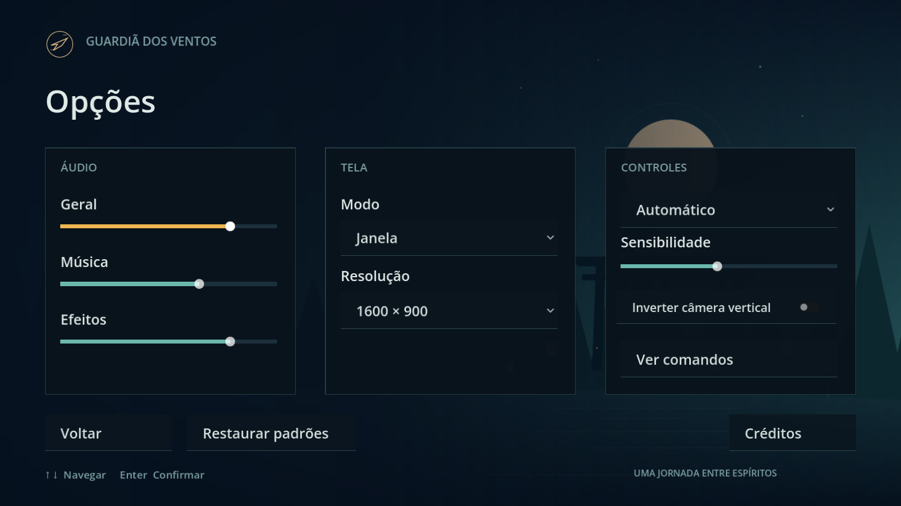
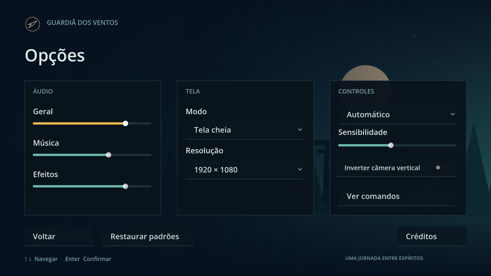

# Settings validation

Engine: Godot 4.7.2.stable.official.ed1daf0bf, Windows 11, D3D12 Forward+. Monitor 2560 ×
1440, usable area 2560 × 1392. Contracts in [engineering/settings.md](../engineering/settings.md).

# Windowed pass for F3-02 and F3-03 — 2026-09-24 (F3-04 part 1)

Part 1 of F3-04, run by lane path: the windowed checks F3-02 and F3-03 left open. It edits no
code. The camera items (sensitivity 2.0 against 0.2, invert flipping `camera_up`, and a new
ship getting the saved values) need part 2's Session wiring and are recorded by part 2
(trunk).

## Method

A throwaway `SceneTree` script, deleted after use, drove `scenes/main.tscn` in a real window
in two separate processes. Both used `Interface.settings_path` =
`user://f304_windowed_check.cfg`, so the real `user://settings.cfg` was never touched; the file
was deleted at the end. Widgets were driven the way a player's edit arrives (a slider's
`value`, an `OptionButton`'s `select` then `item_selected`). Device events went through
`root.push_input`, and the unplug through `Input.joy_connection_changed`. No `SCRIPT ERROR` or
`ERROR:` line in either run. The headless checks of every F3-02 and F3-03 rule are in
`settings.md` ("Options binding", "Input device and disconnect").

## Run 1: display and volumes (Options from the main menu)

| Check | Measured |
| --- | --- |
| Boot with no settings file | Janela, window 1280 × 720 |
| Opções from the main menu | Options on top |
| Resolução 1600 × 900 | Janela, window 1600 × 900; layout intact ([settings-1600x900.png](settings-1600x900.png)) |
| Resolução 1920 × 1080 | Window 1920 × 1080: it fits the 2560 × 1392 usable area, so no step-down (the step-down rule is covered headless in `settings.md`) |
| Modo Tela cheia | `Window.MODE_FULLSCREEN` at 2560 × 1440; the 1280 × 720 layout scaled whole ([settings-fullscreen.png](settings-fullscreen.png)) |
| Modo Janela again | Windowed at the kept 1920 × 1080 |
| Geral 40, Música 0, Efeitos 70 (read back from `AudioServer`, since the game is silent until F13-03) | Master −7.96 dB (`linear_to_db(0.4)`), Music muted, SFX −3.10 dB (`linear_to_db(0.7)`) |
| Left for run 2 | Janela 1600 × 900, volumes 40 / 0 / 70, sensitivity 1.5, invert on, Controle |

## Run 2: relaunch, prompts and Pause

| Check | Measured |
| --- | --- |
| Relaunch (a new process, same file) | Booted straight into Janela 1600 × 900; volumes 40 / 0 / 70 stored and on the buses (Music muted); sensitivity 1.5, invert on and Controle stored |
| Options after relaunch | The widgets show the saved values (Geral 40, 1600 × 900, Controle, invert on) |
| Automático, then a pad button | The keyboard hint (`Layout/NavigationHint`) hidden |
| Then a key | The hint back |
| Direct Stage 1, `pause`, Opções from Pause, Efeitos 20 | Tree paused, Options on top, SFX at −13.98 dB (`linear_to_db(0.2)`) while paused |
| Back, `pause` again | Resumed to the HUD |
| Simulated controller unplug over the HUD (Automático) | Tree paused, Pause on top with Continuar focused |

## Owed to a person

- **The physical keyboard and DualSense pass** over Options, including a real slider drag and
  the D-pad on the dropdowns.
- **A real controller unplug in flight.** Run 2 used a `joy_connection_changed` emission;
  ENGINEERING_BRIEF Section 8 says a simulated gamepad event does not replace a physical
  controller.
- **Listening.** The volume changes were read back from `AudioServer`, not heard; the game
  has no sound until F13-03.

# Camera wiring — 2026-09-24 (F3-04 part 2)

Part 2 of F3-04, run by lane path (the ticket moved there from trunk): the Session applies
the camera sensitivity and invert vertical to every ship. Contract in
[engineering/settings.md "Camera wiring"](../engineering/settings.md#camera-wiring-f3-04).

## Method

Two throwaway `SceneTree` scripts, deleted after use, drove `scenes/main.tscn` with
`Interface.settings_path` on a per-process `user://` file, deleted before and after; the real
`user://settings.cfg` was never touched. Widgets were driven the way a player's edit arrives
(the slider's `value`, the toggle's `button_pressed`). No `SCRIPT ERROR` or `ERROR:` line in
either run. No new tests (the sprint rule).

## Headless run (16 checks, all passed)

| Check | Measured |
| --- | --- |
| File seeded with 1.5 and invert on, then Direct Stage 1 | Rig 1.5, invert on |
| Sensitivity 0.5 from Options on the main menu, then Direct Stage 1 | Rig 0.5 on the first ship |
| Pause, Options from Pause, Sensitivity 1.25 and invert off | Tree paused, Options on top, rig 1.25 and off while paused |
| Back, Resume | HUD, tree running, rig still 1.25 and off |
| Three Restarts | Each new rig 1.25 and off; `Settings.changed` has one connection to the Session |
| Defeat, then Retry from CP1-A (its Snapshot injected into the Director's store) | The Checkpoint branch: a new ship at the Respawn (0, 27, −329), rig 1.25 and off |
| Rig set to 0.77 by hand, then Master volume 33 | Rig still 0.77 |
| Six ticks of `camera_up`, from pitch 0 | 2.0: +0.4189 rad; 0.2: +0.0419 rad (a tenth); 2.0 inverted: −0.4189 rad |

## Windowed look (one short run)

Direct Stage 1 in a 1280 × 720 window. The same 18-tick `camera_up` hold, from pitch 0,
at each setting:

- **2.0:** the view swings up to the sky, the ship seen from below (pitch 0.611 rad, the
  35° limit).
- **0.2:** barely moves; the road ahead is still level in view (0.119 rad).
- **2.0 inverted:** the view swings down, the ship seen from above over the ground (−1.047
  rad, the −60° limit).

The screenshots stayed in the session's scratch folder (the ticket files only the two
display screenshots of part 1).

## Owed to a person (camera)

- **The physical keyboard and DualSense pass** of the orbit at a saved sensitivity, with
  invert on and off. Every input above was simulated (`Input.action_press`).
