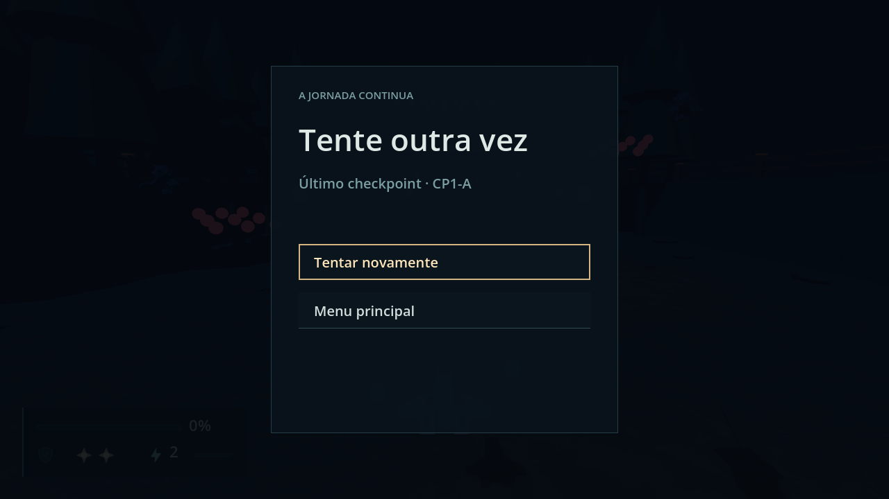
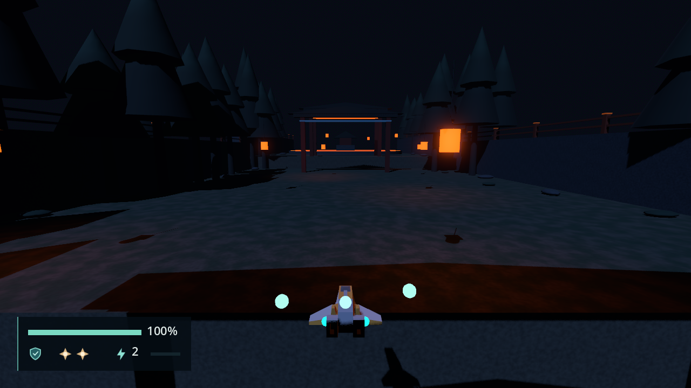

# Stage 1 progression validation

Engine: Godot 4.7.2.stable.official.ed1daf0bf, Windows 11, D3D12 Forward+. Contract in
[engineering/stage-director.md](../engineering/stage-director.md) ("Gate", "Checkpoint",
"Progress application"). F10-01's Encounter checks are in
[stage-director.md](stage-director.md).

# Gates and Checkpoints — 2026-09-23 (F10-02)

## Automated

`tools/test.ps1`: 225 passed, 0 failed, no `SCRIPT ERROR`; no test added (the sprint's
no-new-tests rule). `tools/validate_combat.gd`: `COMBAT_OK`. F10-01's driven pass: still
passes.

## Driven pass: `scenes/main.tscn` and `scenes/stages/stage_01.tscn`

A throwaway `SceneTree` script (not in the repo) drove the real game: Direct Stage 1
through the Session's actions, the ship flown with `move_forward` or teleported with
`reset_to()`, enemies killed through `EnemyActor.take_damage`. Headless for checks 1 to 13,
windowed for 15. No `SCRIPT ERROR` and no unexpected `ERROR:` line. Expected values come
from STAGE_DESIGN ("Checkpoint contract", "Shared encounter rules" and the acceptance
checks), `docs/STAGE_01_HANDOFF.md` and the ticket.

| # | Check (the ticket's list) | Measured |
| --- | --- | --- |
| 1 | Gate open and close are idempotent | Closed as authored: a ray through the barrier hits at Z -224.50. `set_open(true)`: `ClosedVisual` hidden at once, collision off one physics frame later, the ray passes. Repeats change nothing. `set_open(false)` restores both |
| 2 | A Checkpoint reports the player body only | Silent until armed (`monitoring` true two frames after `set_armed(true)`); a layer-2 `CharacterBody3D` and a `StaticBody3D` raise `body_entered` but no `entered`; the ship gives `entered(&"CP1-A")` on each entry. `Respawn` at (0, 27, -329) |
| 3 | S1-02's completion clears hostile fire, then opens its Gate | 50 hostile Projectiles before the last kill (one 0.6 from the Core, due to graze next tick), 0 right after, already 0 when `ClosedVisual` hid; Graze 0 → 0; `gate_opened` once; the collision off the next frame |
| 4 | A closed Gate blocks the ship at every height | `Gate_S1_03`, `move_forward` held 180 ticks from Y 5, Y 37.5, Y 74, (40, 40) and (-40, 60): stopped at Z -223.45 every time, the barrier face minus the ship's half-depth (STAGE_DESIGN "Flying over or under a locked gate cannot skip") |
| 5 | A closed Gate stops Projectiles | A shot at 20 units/s died after 29 ticks at Z -224.33; with the Gate open, the same shot was alive at Z -228.33 |
| 6 | A guard link hides when its guard dies | Links after each kill: shown shown shown → hidden shown shown → hidden hidden shown → all hidden |
| 7 | S1-04's guards open the Gate in two orders | Orders 1-2-3 and, after a Restart, 3-1-2: `gate_opened` once each, the Gate still closed before the last guard. After the Restart all Gates were closed and all links shown |
| 8 | A Bomb kill of the last two guards opens the Gate once | One `damage_targets_in_radius` from a priority-50 node damaged 2 and left 0 enemies: +200 once, `gate_opened` and `encounter_completed(S1-04)` once, no rewards |
| 9 | CP1-A before S1-04 completes does nothing | On a fresh stage and with S1-04 active: `entered` but no activation, resources unchanged (80 %, no Shield, 1 Bomb), a far hostile Projectile not cleared, nothing committed, no Snapshot |
| 10 | The first CP1-A activation clears, refills and commits | Flown back through the arch: Health 60 → 100, the Shield back, Bombs 1 → 2, hostile 1 → 0, committed Active Time 0 → 23.5 (the `clear_time()` of that moment), `bombs_used` kept at 1, `checkpoint_activated` once, the store's latest CP1-A |
| 11 | Revisiting CP1-A does not refill | Damaged to 70 with no Shield, out and back in: `entered` again, no second activation, still 70 with no Shield, nothing cleared, committed time still 23.5 (STAGE_DESIGN "Entering a checkpoint twice cannot repeatedly refill resources") |
| 12 | S1-05 is armed only after CP1-A | Flown at X 30 past the arch into S1-05's EntryVolume: CP1-A not entered, S1-05 inactive, 0 enemies. After the activation, flying into S1-05's EntryVolume started it with 3 enemies. The "already inside at activation" path cannot be flown on Stage 1 (the volumes are 10 units apart); a synthetic `entered` with the ship inside started S1-05 at once |
| 13 | The full Stage 1 route with dev enemies | `encounter_completed` S1-01 to S1-07 in order; all four Gates open; `checkpoint_activated` CP1-A then CP1-B, each refilling to 100 %, the Shield and 2 Bombs; `stage_cleared` once after the `S1-07/Wave1_Boss1` stand-in; `stage_completed` once; then the main menu with `WorldRoot` empty (STAGE_DESIGN "Stage 1 progresses through all seven segments"; no miniboss) |

A broken copy of the stage (a Gate without its script, CP1-A without `Respawn`, a
mismatched `checkpoint_id`, a bad guard-link path) gets one `check_setup()` message for
each. After the reviewer's pass, `check_setup()` also requires every `guard_links` key to
be one of the route's Wave enemy ids; the driven pass ran on that code.

## `/run`: Stage 1 from the main menu, windowed

1280 × 720, flown on the keyboard actions through all eleven legs with no teleport. Gates
opened in order 02, 03, 04, 05. CP1-A took the ship from 60 %, no Shield, 1 Bomb to 100 %,
the Shield and 2 Bombs, and the HUD changed with it; CP1-B the same from 60 % with no
Shield. Each activated once; the stage completed once and the game returned to the main
menu.

`stage-01-progression-gate.png`: just after S1-02 cleared, facing the open `Gate_S1_02`: no
barrier fill between the pillars, the route and further arches beyond, the five Power
Pickups ahead, no hostile fire.

`stage-01-progression-checkpoint.png`: six frames after CP1-A activated, the ship under the
arch's cyan trim, `Gate_S1_05` in the distance. The HUD reads 100 %, the Shield lit, both
Bombs (60 %, no Shield and 1 Bomb just before).

## Not verified

- A physical keyboard or pad; every input is synthetic.
- Retry from a Checkpoint: covered by the F10-03 section below.
- The exit-time leaks from the enemy visual scenes (see [stage-director.md](stage-director.md)
  "Not verified") are still there; they are Astra's.

# Retry and Restart — 2026-09-23 (F10-03)

## Automated

`tools/test.ps1`: 225 passed, 0 failed, no `SCRIPT ERROR`; no test added (the sprint's
no-new-tests rule). Headless regressions: `tools/validate_combat.gd` `COMBAT_OK`, F10-01's
driven pass `SD_OK`, F10-02's driven pass (above) `GC_OK`.

## Driven pass: `scenes/main.tscn`

A throwaway `SceneTree` script (not in the repo) forced Defeat with
`CombatState.take_hit(...)` and pressed Defeat's focused Retry button with `ui_accept`.
Headless, then windowed. No `SCRIPT ERROR` from game code. Each check names its STAGE_DESIGN
"Checkpoint contract" row; expected values are the Snapshot recorded at activation.

| # | Check (the ticket's list) | Measured |
| --- | --- | --- |
| 1 | Retry before any Checkpoint restarts the stage | Died after S1-02 (score 600, 2.82 s, `Gate_S1_02` open): a new Director and ship at `PlayerStart` (0, 7, 20); 100 %, the Shield, 2 Bombs, Power 1/0, score, Graze, bombs used and Clear Time 0; every Gate closed; S1-01 active; Attempt 1 → 2 |
| 2 | Retry after CP1-A resumes at S1-05 | Ship at (0, 27, -329) facing -Z; 100 %, the Shield, 2 Bombs; Power 1/3, score 1110, Graze 1, bombs used 1, Clear Time 3.2167, all equal to the activation values; `RuntimeActors` 5 → 0 and hostile 32 → 0, still 0 after 60 ticks; `Gate_S1_02..04` open, `Gate_S1_05` closed, guard links hidden; Attempt 2. Flying into S1-05 spawned its first Wave |
| 3 | Retry rebuilds a Gate the failed Attempt opened | S1-05 completed (`Gate_S1_05` open, 5 Power Pickups, 3 taken: Power 1/3 → 2/1), died before CP1-B. After Retry: Power 1/3, `Gate_S1_05` closed, S1-05 inactive; flown again, its Waves and its 5 Pickups came back |
| 4 | Retry after CP1-B resumes at the boss approach | Ship at (0, 37, -454) facing -Z, the CP1-B values (score 1710, 6.0167 s), S1-06 complete, S1-07 inactive with nothing spawned; entering it spawned `S1-07/Wave1_Boss1` |
| 5 | A failed Attempt's score and time do not survive Retry | Score 1110 → 1220 → 1110; Clear Time 3.2167 → 6.95 → 3.2167; Graze 1 → 2 → 1; bombs used 1 → 2 → 1 (ENGINEERING_BRIEF 4.H "failed attempts cannot farm score or inflate duration") |
| 6 | A queued Wave is cancelled on Retry | Died with S1-05's second Wave 0.8 s from due: nothing pending after Retry, and 600 ticks at the Respawn gave no Wave, enemy or hostile shot |
| 7 | Revisiting the Checkpoint after Retry does not refill | At 60 % with no Shield, out of and back into CP1-A: two entries, no activation, still 60 % |
| 8 | The Target Lock is clear after Retry | A locked S1-05 enemy before Defeat; after Retry the new ship has no target and the marker is hidden |
| 9 | Defeat names the latest Checkpoint | `Início da fase`, then `Último checkpoint · CP1-A`, then `Último checkpoint · CP1-B` |
| 10 | Restart after a Checkpoint returns to Stage Entry | Restart from Pause after CP1-A (score 1410): a new Director, every Gate closed, Clear Time 0, score 0, Power 1/0, no Checkpoint, ship at `PlayerStart`; the next Defeat read `Início da fase` and its Retry reloaded (ENGINEERING_BRIEF 4.H "restarting differs from retrying") |
| 11 | Three Retries do not double any connection | 32 connection counts (the cores, the field, the Director and machine, both Checkpoints, the 14 volumes, the ship's Targeting, the Interface) identical before and after; the three old ships freed; one defeat +100, one Graze +1 and +10 |

After the reviewer's pass `_retry()` also returns unless a stage is in play; the Retry
driver was rerun headless on that code and passed.

## `/run`: die after CP1-A and Retry, windowed

From the main menu, flown to CP1-A (activated) and into S1-05, then defeated with 32
hostile shots on screen. Defeat read `Último checkpoint · CP1-A`. Retry: the ship at the
Respawn with 0 hostile shots and 0 enemies, 100 %, the Shield and 2 Bombs, `Gate_S1_05`
closed.

`stage-01-retry-defeat.png`: the Defeat panel ("Tente outra vez", `Último checkpoint ·
CP1-A`, "Tentar novamente" focused) over the frozen field and its hostile fire.

`stage-01-retry-respawn.png`: right after Retry, the ship at CP1-A's Respawn facing the
route to S1-05, no bullets or enemies, the HUD full (100 %, the Shield, 2 Bombs, Power 2).

## Not verified, and open

- **Resolved by F10-05 (2026-09-24): uncollected earlier rewards were lost on Retry.** Retry removed every runtime Pickup, as
  the ticket says, including ones left behind before the Checkpoint (S1-02's Power Pickups,
  S1-03's Shield Pickup). Their Encounters stay rewarded, so they never drop again.
  STAGE_DESIGN says to remove pickups "from the failed segment" and that completed rewards
  "remain resolved"; whether the earlier ones should come back is a design call, raised in
  the handoff log. Astra decided that Retry restores the Pickups live at the Checkpoint's
  activation; see [stage-director.md](stage-director.md) "Retry restores the Checkpoint's Pickups".
- A Bomb blast still playing at the moment of Retry was not observed.
- A physical keyboard or pad.
