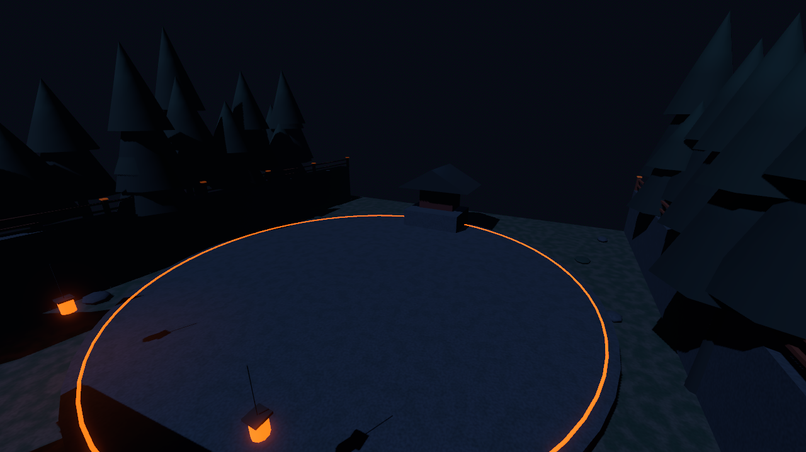
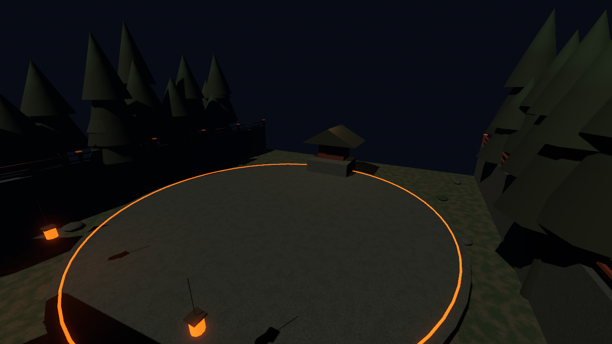

# Stage 1 shrine lighting — D-07 Parts A and C

`Environment/ShrineLighting` plays `corrupted_to_calm` for 2.4 seconds after the Lantern Guardian falls. The clip is non-looping, has no autoplay and runs while Results pauses the stage. It animates only the stage's Moonlight and a shrine-local OmniLight3D: blue and dim at the first key, warm gold at the last. The Stage script, exports, geometry, markers and collision were not changed. Trunk F14-01 must set `defeat_presentation = NodePath("Environment/ShrineLighting")` and `defeat_animation = &"corrupted_to_calm"`.

The Stage 1 validator passed headless and windowed with zero failures. It checked the first and last clip keys, the process mode, autoplay and loop settings, and that a second scene instance begins corrupted after the first reaches calm. Windowed Forward+ captures were inspected at the same camera position; the shrine, ground and trees visibly warm while the arena layout stays fixed.

The Lantern Guardian now has 550/550/775 health, versus 1500/1500/2100 before review. At the observed 22.1 Power-3 damage/s, the three Phases target roughly 25/25/35 seconds. Existing ring steps alternate high and low; aimed bursts follow the player's height, so a fixed height does not stay safe throughout an Attack. The 20-damage Bomb cannot end a full Phase. A full fight after this tuning remains to be observed.
