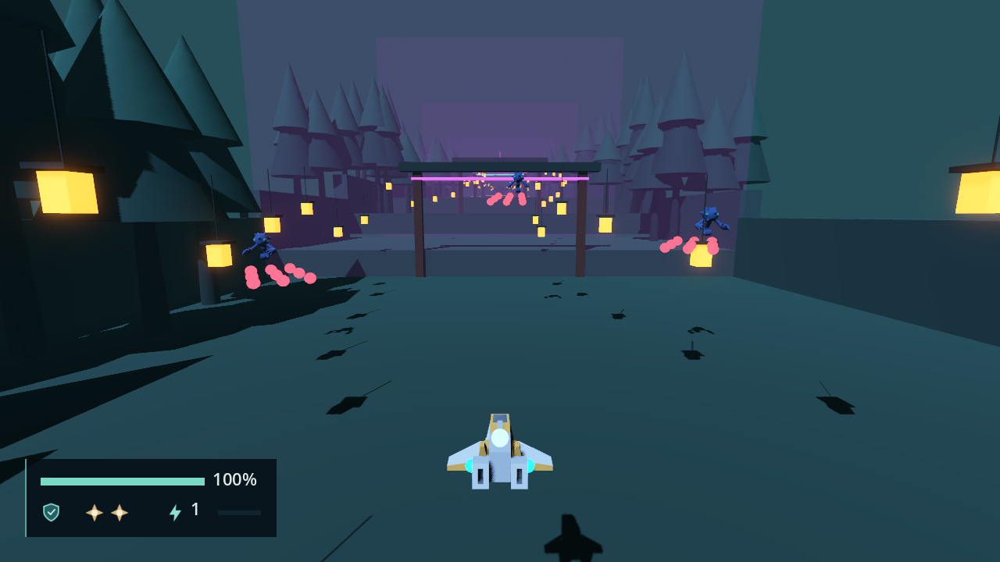
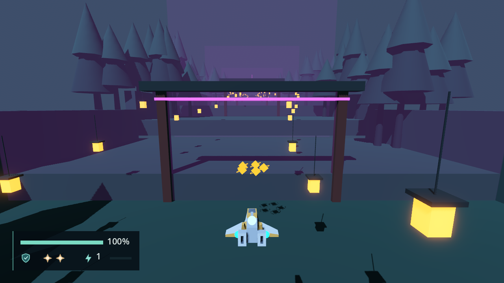

# Stage Director validation

Engine: Godot 4.7.2.stable.official.ed1daf0bf, Windows 11, D3D12 Forward+. Contract in
[engineering/stage-director.md](../engineering/stage-director.md). Each F10 ticket adds its
own headed section.

# Encounters, Waves and rewards — 2026-09-23 (F10-01)

## Automated

`tools/test.ps1`: 225 passed, 0 failed, no `SCRIPT ERROR`; no test added (the sprint's
no-new-tests rule). `tools/validate_combat.gd` headless: `COMBAT_OK`, all checks.

## Driven pass: `scenes/main.tscn`

A throwaway `SceneTree` script (not in the repo) drove the real main scene through the
Session's actions, flew or teleported the ship with `reset_to()`, and killed enemies
through `EnemyActor.take_damage`. Headless for checks 1 to 14, then in a 1280 × 720 window
for the captures. No `SCRIPT ERROR`; the only `ERROR:` line during play is the refusal
check 10 expects. Expected values come from STAGE_DESIGN's Stage 1 table and "Shared
encounter rules", PLANEJAMENTO Section 4 (100 per common enemy) and the ticket.

| # | Check (the ticket's list) | Measured |
| --- | --- | --- |
| 1 | Stage entry activates S1-01 | Stage root a `StageDirector`, S1-01 active, 0 enemies, HUD on top; all 14 volumes monitoring with one connection each; the Session's `stage_cleared` connection deferred |
| 2 | Entering S1-02 spawns Wave 1 under `RuntimeActors` | Flown with `move_forward` from Z 20 to Z -61 (405 ticks): S1-01 completed on its ExitVolume, then S1-02 activated. 3 `EnemyActor`s, ids `S1-02/Wave1_Spirit1..3`, each 0.0000 from its marker |
| 2b | They fire after the Anticipation | 0 hostile Projectiles at 0.5 s; the first 61 ticks (1.017 s) after the spawn; 18 ten ticks later |
| 3 | Wave 2 after Wave 1 is defeated | Requested 59 frames (0.983 s) after the last kill (60 countdown ticks; the kill lands before that frame's tick); 3 Spirits, each 0.0000 from the Wave 2 markers |
| 4 | S1-02 drops five Power Pickups at `RewardOrigin`, once | 5 Pickups `S1-02/power_1..5`, each 1.500 horizontally from `RewardOrigin` (0, 9, -130), dy 0; still 5 thirty ticks later; `rewards_requested` once. Kills scored +600 |
| 5 | Defeat scores once per enemy | A kill +100; a second `defeated` emit from the same actor +0; the handler called again directly +0 |
| 6 | Entry out of order spawns nothing | On a fresh start, S1-03's EntryVolume: 0 enemies, S1-03 INACTIVE, S1-01 still active. S1-02's EntryVolume without crossing S1-01's exit: 0 as well |
| 7 | Re-entering a completed Encounter spawns nothing | S1-02's EntryVolume and ExitVolume again after it completed: 0 enemies, still 5 Pickups, no Wave or reward request |
| 8 | S1-03's Shield Pickup spawns at its marker | 2 Sentries at their markers; with both dead S1-03 stays active until its ExitVolume (`requires_exit`); then one Pickup `S1-03/shield_1` 0.0000 from `ShieldPickup` (12, 24, -218) |
| 9 | Active Encounter bounds span the Encounter | S1-02 active: X -45..45, Y 0..75, Z -139..-58 |
| 10 | `check_setup` names a missing kind; invalid setup refuses the stage | With `actor_scenes["spirit"]` erased: 10 messages, one per Spirit marker, for example `stage 'stage_01': Wave kind 'spirit' at 'Encounters/S1-02/Spawns/Wave1_Spirit1' has no 'actor_scenes' entry`; the shipped stage gives 0. That variant packed into `stage_scenes`: one `ERROR: /root/Main: … the stage is not started`, the menu stays, `WorldRoot` empty |
| 11 | Stage clear completes the stage | Right after the emit the phase is still IN_STAGE (deferred); `stage_completed` then fires with STAGE_COMPLETE the same frame, and the Session returns to the main menu (until F11-01) |
| 12 | A threat report shows the HUD threat | `threat_reported(-1)` shows `ThreatLeft` only, relayed once, hidden again after 1.25 s |
| 13 | Stage 2 without a Director still flies | Root not a `StageDirector`, the Session's `_director` null; 1 s of `move_forward` moved the ship (0, 0, -12) |
| 14 | Restart builds a new Director without doubled connections | New Director, the old one freed, score 0, one Session connection each on `stage_cleared` and `threat_reported`, one on each actor's `defeated`; one defeat +100. Two more Restarts: +100 again, one connection each, 2 `WorldRoot` children |

A single teleport into the band where S1-01's ExitVolume and S1-02's EntryVolume overlap
(Z -58.5) also activates S1-02: the Director's re-check after a completion.

The reviewer found that an `enemy_definitions` entry failing its own `validate()` passed
the pre-check, so every enemy refused to spawn and S1-02 could never complete. After the
fix, `check_setup()` also validates every enemy definition and requires a box shape under
each volume: the reviewer's probe with a Spirit definition at `health = 0` now gets
`stage 'stage_01': enemy_definitions 'spirit': EnemyDefinition 'spirit': health must be
above 0`, one refusal `ERROR:`, and the menu stays. The driven pass above was rerun
headless on the final code and passed again.

`stage-director-s1-02.png`: from the main menu, Direct Stage 1, flown into S1-02. The three
Spirits of Wave 1 fire strings of hostile rounds at the ship (27 in flight); the HUD reads
100 %, the Shield, 2 Bombs, Power 1.

`stage-director-rewards.png`: after both Waves, the five Power Pickups in a ring at S1-02's
`RewardOrigin`, in front of the closed `Gate_S1_02` barrier; score 600.

## Not verified

- A physical keyboard or pad; the flight is synthetic input.
- Past `Gate_S1_02` in normal flight: the Gates open in F10-02, so checks 6 to 8 teleport.
- **Exit-time leaks from the enemy visuals.** Every spawned enemy leaks its glTF subtree at
  exit (`N RID allocations … leaked`, `26 ObjectDB instances were leaked`). Loading and
  freeing `scenes/enemies/visuals/spirit_lume.tscn` alone leaks the same way: it and
  `sentry_lantern.tscn` declare `CharacterArmature`, `Skeleton3D`, the mesh and the
  `AnimationPlayer` again as new typed nodes under the instanced `Model`, so each enemy
  holds duplicate children (and probably draws its model twice). Not F10-01's; requested of
  Astra in the handoff log.
