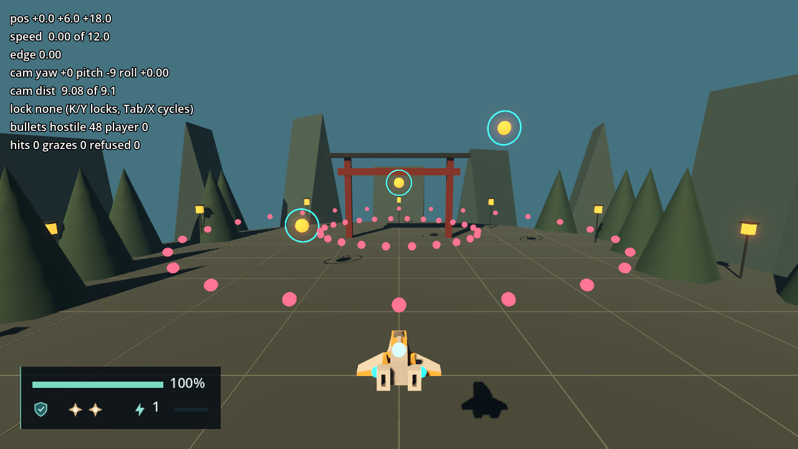
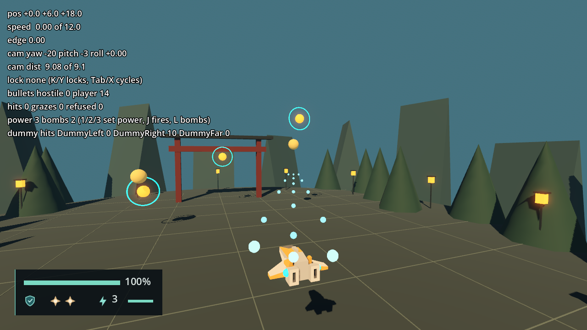

# Weapon and rendering validation

Engine: Godot 4.7.2.stable.official.ed1daf0bf, Windows 11, D3D12 Forward+, Jolt physics.
Contract in [engineering/weapon-rendering.md](../engineering/weapon-rendering.md).

# ProjectileSystem and the dev spray — 2026-09-23 (F6-02)

## Automated

`tools/test.ps1`: 225 passed, 0 failed, no `SCRIPT ERROR`. F6-02 adds no test file (the
sprint's no-new-tests rule of 2026-09-23). The Return to Menu case of
`test_game_session_flow.gd` now spawns a hostile Projectile and expects `count() == 0`
after unloading, since `ProjectileRoot`'s children are the renderers.

## Scripted runs

A verifier agent drove the game with throwaway `SceneTree` scripts (deleted after use),
headless and then windowed, and printed no `SCRIPT ERROR`, `ERROR:` or warning line.

### Arena harness (`scenes/dev/arena_harness.tscn`)

| Check | Result |
| --- | --- |
| Hostile count every 0.5 s over 12 s | 0, 0, 0, 24, 24, 24, 48, 48, 47, 71, … up to 128: one ring every 1.5 s |
| Bullets die | With the spray stopped, 107 bullets went to 0 in 7.70 s (lifetime 10 s) |
| Rings stop at the walls | A ring with a 30 s lifetime: all 24 died at a wall face, after 5.5 to 9.2 s |
| No bullet beyond a wall | Every sampled position inside: max \|x\| 39.000, z from −45.000 to 32.996 |
| Hits and Grazes, ship at its start (0, 6, 18) | 3 hits and 3 Grazes from the rings that reached it |
| Ship at (0, 6.6, 18): 0.6 off the ring plane, inside the Graze reach (0.55 + 0.25) and outside the Core reach (0.18 + 0.25) | Grazes +2, hits +0 |
| Renderer instances against the field count | 0 mismatches over every tick; 0 drawn once the field was empty |
| Refused spawns | 0 |

`weapon-rendering-spray.png`: 4 s in, 48 hostile bullets; a ring about 3 units in front
of the ship and the next one by the torii gate, with the readout's new lines.

### Menu to stage flow (`scenes/main.tscn`)

| Check | Result |
| --- | --- |
| Direct Stage 1 | HUD; the ship at (0, 7, 20); the sweep on |
| Spawned bullets move | 3 bullets moved 0.333 in 10 ticks |
| `pause`, 30 physics frames | Largest position change 0.000000 |
| Resume | Moving again, 0.333 in 10 ticks |
| Restart from Pause | Count 0 at once and 5 ticks later; the new ship wired in; renderers drawing 0 |
| Return to Menu from Pause | Count 3 before, 0 after, still 0 after 10 ticks; both renderers at `visible_instance_count` 0; main menu |
| A bullet aimed at the ship's Core, Stage 1 | Hits +1 |
| Direct Stage 2 | The ship at (0, 10, 25), the stage's bounds applied, the sweep on; a Core shot hits |

## Reviewer findings fixed before landing

- A ship with no `DamageCore` or `GrazeVolume` crashed `setup()`; the report and
  `clear_all()` are now null-safe.
- The refused count ran across stages; `setup()` now re-runs the field's `setup`, which
  resets it.
- A target registering from inside the tick's events lost its damage callback; the tick
  now uses a swapped-out copy of the callbacks.
- The obstacle ray now sets its body and area flags explicitly and `hit_from_inside`, so
  a Projectile spawned inside scenery dies there.

The verifier's runs came before these fixes. After them, a headless harness run of 8 s
peaked at 116 hostile bullets, counted 2 hits and 2 Grazes, refused none, and printed no
error.

## Measurement

The folded F6-01 benchmark is in
[engineering/spikes/projectile-rendering.md](../engineering/spikes/projectile-rendering.md):
1118 FPS and a 3.84 ms `ProjectileSystem` physics step at 3000 Projectiles.

## Not verified

- Flying through the rings with a physical keyboard or pad: the ship was placed with
  `reset_to`.
- Enemy hit spheres from real actors (F9-02); the `register_target` path was exercised
  only by review and by the field's own contract.

# PlayerWeapon, Familiars and target dummies — 2026-09-23 (F6-03 part 2)

## Automated

`tools/test.ps1`: 225 passed, 0 failed, no `SCRIPT ERROR`; no test was added or changed
(the sprint's no-new-tests rule).

## Scripted pass in the arena harness

A throwaway `SceneTree` script (deleted after use) loaded `scenes/dev/arena_harness.tscn`
with the dev spray stopped and drove the real actions (`fire`, `lock_target`,
`next_target`, `camera_left`, the dev keys 1 to 3 and `bomb` pushed as events). It
printed `WEAPONCHECK_OK` headless and then in a 1280 × 720 window, with no `SCRIPT ERROR`
or `ERROR:` line.

| Check | Result |
| --- | --- |
| Holding `fire` 30 ticks at Power Level 1 | 5 shots (0.1 s cadence); no Familiars |
| Orbit 90° with `camera_left`, then fire | Shots travel along the view: (-0.994, -0.109, 0.001) against the view (-0.988, -0.156, 0.000), yaw 90° |
| Lock `DummyRight` with `lock_target` and `next_target`, fire 60 ticks | 10 hits on the dummy |
| Key 2 | Power Level 2 on the HUD, two Familiars shown |
| Fire 30 ticks at Power Level 2, then 3 (lock released) | 9 and 13 shots, against 5 at level 1 |
| Familiars' collision objects | 0 |
| Fire 90 ticks at the far wall | Peak 27 player shots in flight, none ever past a wall |
| Three `bomb` presses, each held 30 ticks | 2 Bombs spent from 2, then none: one per press |

Before the Aim Assist reading in `weapon-rendering.md` ("Forward"), the locked dummy took
0 hits: measured from the camera's own axis, the Muzzle's parallax put it 12.4° off,
outside the 10° main cone.

The reviewer then found two defects, fixed before landing: a close locked target could put the aim point behind the Muzzle and send shots steeply up (the point now stays 8 units ahead of each origin, at the target's depth along the view), and a Familiar scene with a collision object at its root passed the check. A headless rerun after the fixes gave the same numbers, `WEAPONCHECK_OK`; the screenshot comes from the run before them.

`weapon-rendering-familiars.png`: Power Level 3 with both Familiars beside the ship and
the main and Familiar shots streaming ahead; the HUD shows Power Level 3 with the full
bar, and the readout the three dummies (`DummyRight 10`).

## Not verified

- Holding J, K and L on a physical keyboard, or the pad; every input was synthetic.
- The dummies' flash, beyond the hit count.
